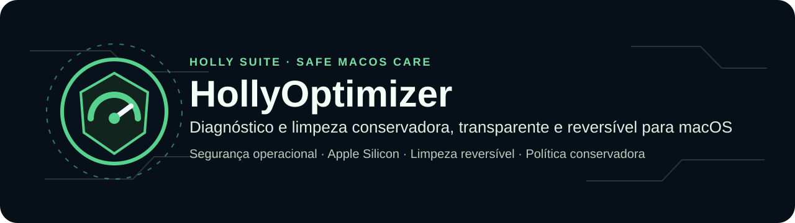
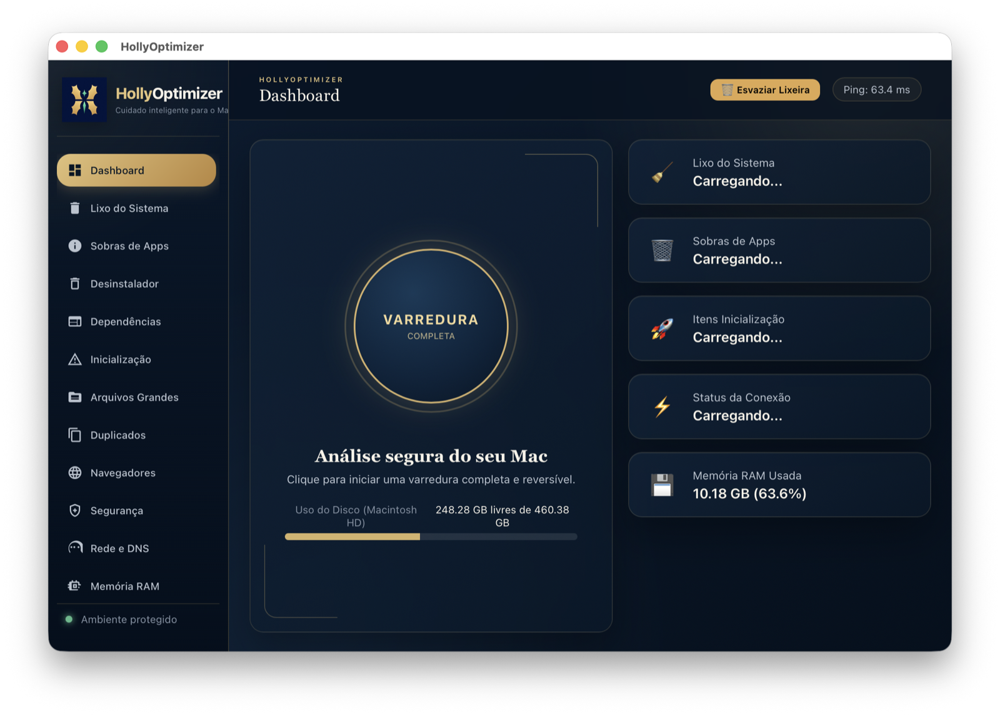
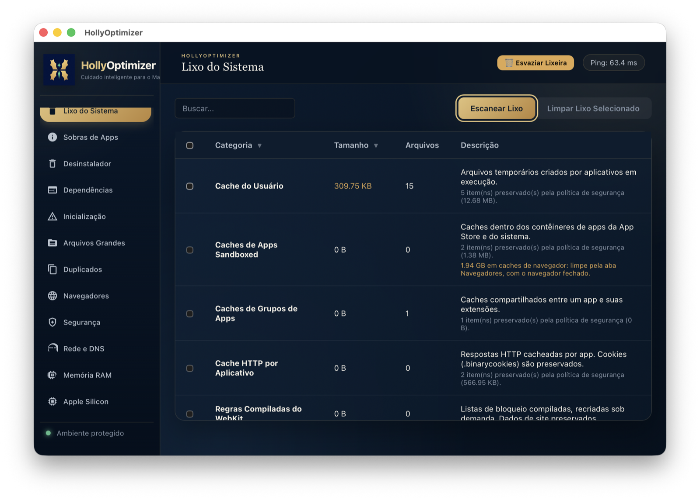
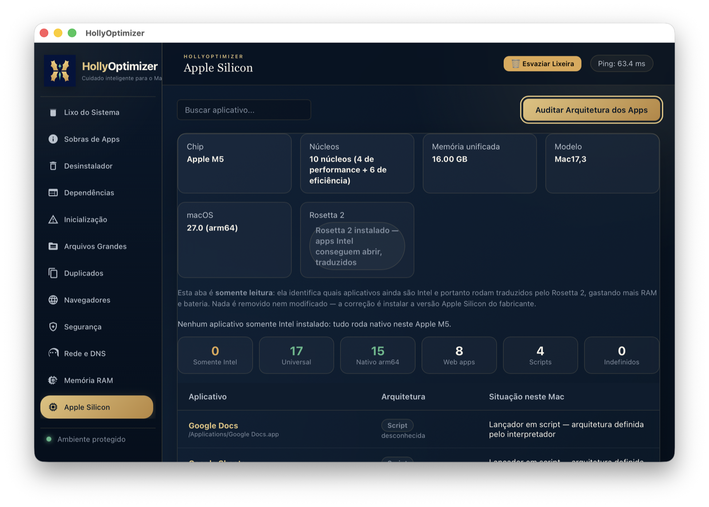
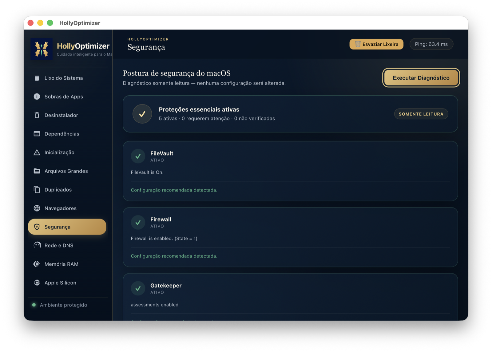

<p align="center">
  
</p>

<p align="center">
  <strong>Diagnóstico e limpeza segura, transparente e reversível para macOS.</strong><br>
  Política conservadora · Apple Silicon · Recuperação pela Lixeira
</p>

<p align="center">
  <a href="https://github.com/HollyGM/HollyOptimizer/actions/workflows/ci.yml"></a>
  
  
  
  <a href="LICENSE"></a>
</p>

> **Parte da suíte Holly**  
> Ferramentas local-first para texto, documentos e mídia, com privacidade por padrão e segurança verificável.  
> [HollyOCR](https://github.com/HollyGM/HollyOCR) · [HollyTranscrição](https://github.com/HollyGM/HollyTranscricao) · [HollyCorretor](https://github.com/HollyGM/HollyCorretor)



O **HollyOptimizer** é um utilitário desktop para diagnosticar o Mac, localizar desperdício de espaço e executar correções seguras. O projeto combina Python, PyWebView, HTML, CSS e JavaScript e foi otimizado para Apple Silicon, sem abandonar a compatibilidade de desenvolvimento com Macs Intel.

> A versão atual é **0.6.2 (build 15)**. O aplicativo foi validado em um MacBook com chip Apple M5. O código é específico do macOS; Windows e Linux poderão receber implementações próprias no futuro, mas ainda não são suportados.

## Recursos

- **Limpeza reversível:** caches e arquivos temporários elegíveis são enviados à Lixeira nativa; ela nunca é esvaziada automaticamente.
- **Política central de segurança:** Keychains, iCloud, Mail, Messages, SSH, bancos de dados, cookies e outras áreas sensíveis são bloqueados.
- **Sobras de aplicativos:** detecção conservadora, limitada a itens cujo aplicativo de origem pode ser verificado.
- **Navegadores:** limpeza dedicada de caches de Safari, Firefox e navegadores Chromium, preservando histórico, senhas, cookies, sessões, favoritos e extensões.
- **Inicialização:** inventário e gerenciamento de LaunchAgents, LaunchDaemons e itens de início de sessão.
- **Arquivos grandes e duplicados:** busca configurável, confirmação antes da remoção e revalidação por SHA-256.
- **Dependências:** auditoria de Homebrew, NPM e Pip.
- **Segurança:** diagnóstico somente leitura de FileVault, Firewall, Gatekeeper, SIP e atualizações.
- **Rede e memória:** diagnóstico de DNS, latência, pressão de memória e swap, sem usar `purge`.
- **Apple Silicon:** identifica chip, núcleos, memória unificada, Rosetta 2 e a arquitetura dos aplicativos instalados.

## Capturas de tela

| Lixo do Sistema | Apple Silicon |
|---|---|
|  |  |

| Dashboard | Segurança |
|---|---|
|  |  |

## Modelo de segurança

O HollyOptimizer adota privilégio mínimo e separa claramente inventário, revisão manual e limpeza automática.

- Dados comuns do usuário são processados sem elevação de privilégios.
- Itens removíveis são movidos para a Lixeira pela API nativa do macOS.
- Caches de navegador só são limpos com o navegador fechado.
- Snapshots locais do Time Machine, Docker Data, Xcode Archives, simuladores, backups de iPhone/iPad e caminhos do sistema são apenas medidos e informados.
- Itens recusados pela política são contabilizados e explicados na interface.
- A auditoria Apple Silicon é somente leitura e nunca altera ou “afina” binários universais.
- Esvaziar a Lixeira depende de autorização explícita de Automação do Finder.
- Acesso Total ao Disco é opcional; sem ele, o aplicativo continua funcionando e informa os locais inacessíveis.

Leia [SECURITY.md](SECURITY.md) antes de relatar uma possível vulnerabilidade.

## Requisitos

- macOS 12 ou posterior;
- Python 3.12 ou posterior para desenvolvimento;
- dependências fixadas em [`requirements.txt`](requirements.txt).

## Executar a partir do código

```bash
git clone https://github.com/HollyGM/HollyOptimizer.git
cd HollyOptimizer
python3.12 -m venv .venv
.venv/bin/python3 -m pip install --upgrade pip
.venv/bin/python3 -m pip install -r requirements.txt
.venv/bin/python3 hollyoptimizer_gui.py
```

A versão alternativa de terminal pode ser iniciada com:

```bash
.venv/bin/python3 hollyoptimizer.py
```

## Testes

```bash
.venv/bin/python3 -m unittest discover -s tests -v
.venv/bin/python3 hollyoptimizer_gui.py --self-test
.venv/bin/python3 -m compileall -q core hollyoptimizer.py hollyoptimizer_gui.py
node --check gui/app.js
```

## Gerar o aplicativo

```bash
PYTHON_BIN=.venv/bin/python3 ./build.sh
```

O bundle será criado em `dist/HollyOptimizer.app`. Sem uma identidade Apple, o script produz um build de desenvolvimento com assinatura ad-hoc, adequado para uso local.

### Distribuição assinada e notarizada

Para distribuir o aplicativo a outros Macs, use uma identidade **Developer ID Application**, Hardened Runtime e um perfil do `notarytool`:

```bash
xcrun notarytool store-credentials hollyoptimizer-notary

HOLLYOPTIMIZER_RELEASE=1 \
PYTHON_BIN="/caminho/para/python3.12" \
CODESIGN_IDENTITY="Developer ID Application: Sua Empresa (TEAMID)" \
NOTARY_PROFILE="hollyoptimizer-notary" \
./build.sh
```

O alvo padrão é a arquitetura nativa do Mac usado na compilação. Solicite `universal2` apenas quando houver intenção real de distribuir também para Macs Intel e todas as dependências oferecerem `arm64` e `x86_64`.

## Estrutura

```text
HollyOptimizer/
├── core/                       # Backend e política de segurança
├── gui/                        # Interface HTML, CSS e JavaScript
├── tests/                      # Testes automatizados de segurança
├── docs/screenshots/           # Imagens usadas na documentação
├── hollyoptimizer_gui.py       # Aplicativo desktop
├── hollyoptimizer.py           # Interface de linha de comando
├── HollyOptimizer.spec         # Configuração do PyInstaller
└── build.sh                    # Build, assinatura e notarização
```

## Colaboração

Contribuições são bem-vindas. Consulte [CONTRIBUTING.md](CONTRIBUTING.md), abra uma issue com o modelo apropriado e envie as alterações por pull request. Mudanças que removem arquivos precisam manter as garantias de confirmação, validação de caminho e recuperação pela Lixeira.

As mudanças de cada versão estão em [CHANGELOG.md](CHANGELOG.md).

## Licença

Copyright 2026 Thiago Albuquerque.

Distribuído sob a [Apache License 2.0](LICENSE). Consulte também o arquivo [NOTICE](NOTICE).
